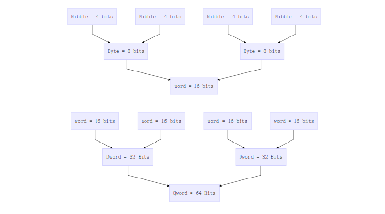
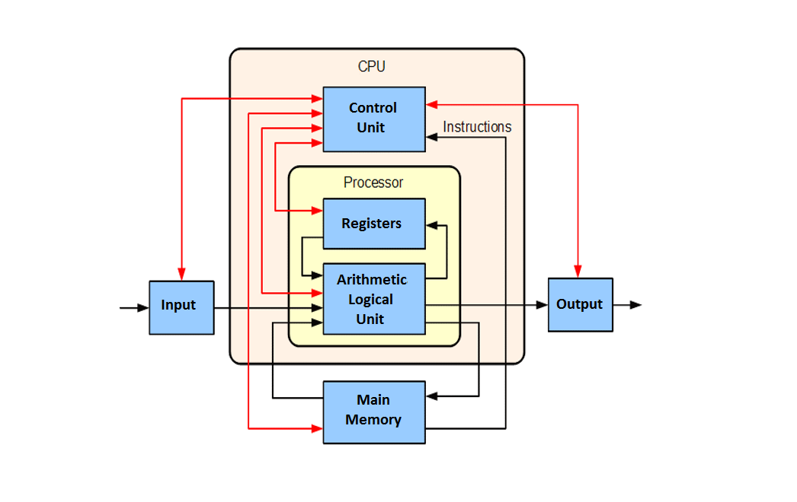
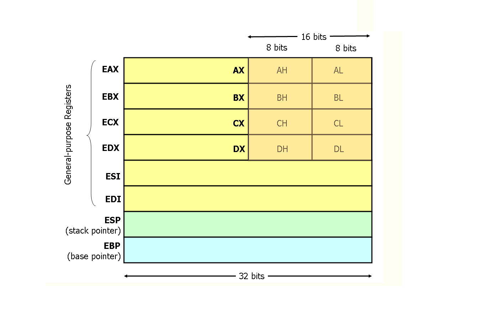
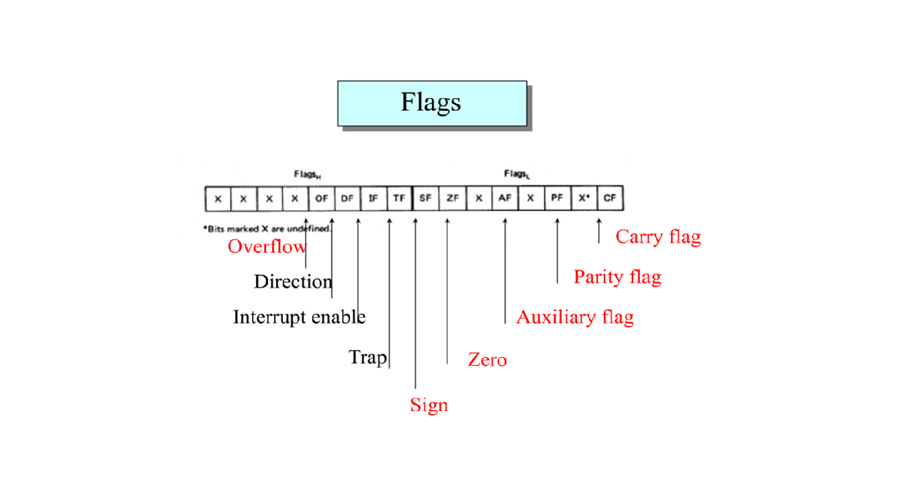
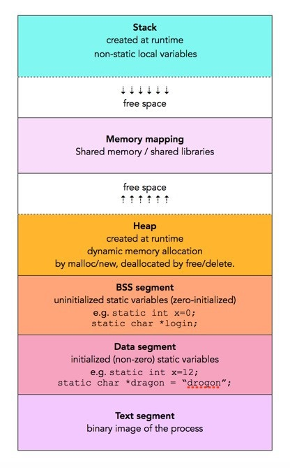
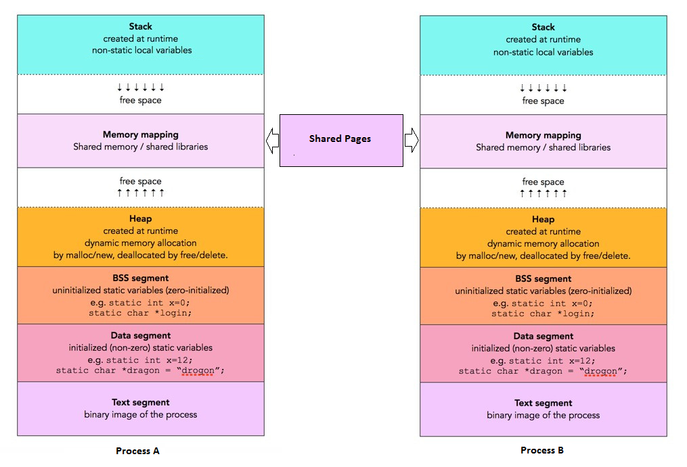

> الحاسوب هو آلة تقوم بمعالجة المعلومات.  كل المعلومات في الحاسوب هي شحنات كهربائية تسمي بيتات Bits. والـ Bit يمكنه ان يكون 1 او 0 فقط ويسمي ذلك النظام في تمثيل البيانات النظام الثنائي Binary system، وتشكل سلسلة من الـ Bits جميع اشكال البيانات التي يمكن معالجتها وعرضها بداية من الارقام والأحرف حتي الملفات والبرمجيات. 
>

### ==الـ Binary والـ Hexadecimal==

النظام الثنائي Binary system يمتلك اساس Base/Radix يساوي 2 ويتكون من 0 او 1 فقط. ويمكن تمثيل البيانات من الأحرف  والارقام وغيرها عن طريق سلسلة من نفس الرقمين فكمثال الحرف ```A``` يمكن تمثيله بـ 8 بيتات كالتالي ```0b01000001``` 

الشكل التالي يوضح عدد البيتات واسم البيانات الذي يقابلها:



والطريقة التي يتم بها معالجة البيانات غير مشروطة بمحتوي البيانات نفسها فالـ Byte ```0b01011101``` يمكن ان تمثل الرقم ```93``` او الرمز النصي ```[``` او تعليمة لغة الألة ```pop ebp```.

بسبب صعوبة التعامل مع النظام الثنائي يتم استخدام النظام الستة عشري Hexadecimal والذي يتكون من ستة عشر رقم وحرف هما 

```0 1 2 3 4 5 6 7 8 9 A B C D E F``` 

ويمتلك الـ Base/radix 16، في هذا النظام يمثل الرقم او الحرف 1 Nibble فكمثال يمكن تمثيل الـ Byte السابقة بالشكل التالي  ```0x5D```.


### ==وحدة المعالجة المركزية Central Processing Unit==

وحدة المعالجة المركزية  Central Processing Unit CPU هي وحدة داخل الحاسوب تقوم بمعالجة البيانات وتنفيذ تعليمات لغة الألة Machine Code Instructions ويمكن تخيلها كالعقل للحاسوب فهي تتواصل مع وحدات اللإدخال والإخراج Input/output I/O Devices وذاكرة الحاسوب عن طريق ناقلات تسمي Buses  لتقوم بمعالجة البيانات وتنفيذ الأوامر المطلوبة وتظل تلك العملية من تحديد البيانات ومعالجتها من ثم اعادتها للذاكرة او لوحدات الإخراج قائمة طوال فترة التشغيل. الشكل التالي يوضح التصميم المعماري لأغلب اجهزة الحاسوب الحديثة بما فيها `x86` و`x64`  والتي يطلق عليها معمارية Von Neumann او the Von Neumann architecture.




#### ==وحدة التحكم Control Unit==

وحدة التحكم  Control Unit CU هي جزء من وحدة المعالجة المركزية  Central Processing Unit CPU. وتقوم وحدة التحكم بإدارة العمليات التي يقوم بها المعالج Processor، فهي تقوم بإدارة طريقة استلام وتنفيذ البيانات والأوامر بين ذاكرة الحاسوب والوحدة المنطقية الحسابية Arithmetic Logic Unit ALU ووحدات الإدخال والإخراج.

#### ==الوحدة المنطقية الحسابية Arithmetic Logical Unit==

الوحدة المنطقية الحسابية Arithmetic Logic Unit ALU هي المسؤولة عن كل العمليات الحسابية والمنطقية التي يمكن عملها داخل وحدة المعالجة المركزية وتتضمن تلك العمليات:

- عمليات منطقية Logical Operations مثل ```AND``` ```OR``` ```NOT``` ```XOR``` ```NOR``` ```NAND```  وغيرها.

- عمليات تحويل ونقل البيتات Bit-Shifting Operations وتتضمن نقل البيتات من اماكنها بعدد معين من النقلات لليمين او اليسار مما يمكن اعتباره احد عمليات الضرب Multiplication Operation.

- عمليات حسابية Arithmetic Operations وتتضمن الجمع والطرح والضرب والقسمة وغيرها.

#### ==المسجلات Registers==

المسجلات هي مساحات تخزينية صغيرة داخل وحدة المعالجة المركزية. وتقوم وحدة المعالجة المركزية بستخدام تلك المساحة في تخزين البيانات الجاري معالجتها بشكل مؤقت لسرعة تلك المسجلات في نقل وتخزين البيانات عن ذاكرة الوصول العشوائي Random Access Memory RAM. فيما يلي وصف مفصل عن المسجلات في معمارية ```x86``` .

##### ==مسجلات عامة الغرض General-purpose registers==

في معمارية ```x86``` يوجد 8 مسجلات ذات اغراض عامة هم ```EAX``` `EBX` `ECX` `EDX` `ESP` `EBP` `ESI` `EDI`. وتلك المسجلات تمتلك مساحة `32Bits` او ما يساوي  `4Bytes` لذلك احيانا يتم تسميتها معمارية الـ `32bit`. والبرنامج اثناء تشغيله يمكن ان يستخدم مساحات مختلفة داخل المسجل نفسه  فيمكن ان يستخدم مساحة بحجم `32Bits` او `16Bit` او `8Bit` فكمثال داخل المسجل `EAX` لتخزين مساحة بحجم ` Dword = 32Bits` سنستخدمه كاملا بينما يمكننا استخدام المسجل `AX` لتخزين قيمة حجمها `Word = 16Bits` وحتي نسجل قيمة بحجم `Byte = 8Bits` يمكننا استخدام المسجل `AH` او `AL`. الشكل التالي يعطي فكرة اعمق حول المسجلات العامة وكيفية تقسيمها:



لاحظ تغير لون الـ ```ESP``` والـ ```EBP``` فهم يتم استخدامهم للتعامل وإدارة المكدس Stack كما سنناقش في الاجزاء القادمة.

##### ==مؤشر التعليمات instruction pointer==

ومن المهم إدراك أن وحدة المعالجة المركزية في معمارية ```x86```  تمتلك مسجل خاص يسمي ```EIP``` ويحتوي عنوان التعليمة التي سيتم تنفيذها بعد الإنتهاء من تنفيذ التعليمة الحالية. ويختلف عن المسجلات العامة في خصوصية غرضه واستخدامه فدائما ما سيشير مؤشر التعليمات علي التعليمة التي سيتم تنفيذها فقط.

##### ==Segment Registers==

الـ Segment registers تعمل جابنا الي جنب مع مسجلات الأغراض العامة General-purpose registers للوصول إلي عناوين الذاكرة الخاصة بالبيانات اثناء عملية التشغيل. وتخزن الـ Segment registers عنوان بداية الـ Segment فكمثال للوصول لبيانات معينة من الـ Data segment DS يتم استخدام الـ Data segment register مع اضافة قيمة الـ Offset الخاص بتلك البيانات `DS Register + Offset value`. الشكل التالي يوضح تقسيم الـ Segment registers. 


##### ==سجل الرايات EFlags Register==

سجل الرايات EFlags Register هو سجل بحجم ```32Bits``` كل `Bit` من هذا المسجل تمثل راية.
 وتلك الرايات يتم وضعها كـ `True = 1` او `False = 0` بعد التأكد من صحة او بطلان العبارات الشرطية Conditional statements وعلي ذلك يتم تحديد التعليمات التي سيتم تنفيذها في حالة صحة او بطلان العبارة. 
الشكل التالي يعرض اهم الرايات وتقسيمها بين رايات وضع Status flags ورايات تحكم Control flags: 




### ==ذاكرة الوصول العشوائي Random Access Memory==

الذاكرة العشوائية  Random Access memory RAM هي المسؤولة عن تخزين البيانات التي سيتم استخدامها او تعليمات لغة الآلة التي سيتم تنفيذها في مصفوفة من الـ `Bytes` تأخذ شكل النظام الستة عشري، ولكل `Byte`رقم مميز يستخدم كعنوان Memory address للوصول لها. فكمثال عندما يتم تشغيل برنامج من قبل المسخدم يقوم نظام تشغيل بقراءة وتحميل البرنامج الي عنوان ذاكرة مخصصة له allocated memory address في الذاكرة العشوائية، ومن هنا يبدأ تنفيذ البرنامج. 

#### ==الذاكرة الافتراضية Virtual memory==

عند تحميل البرامج للذاكرة العشوائية ليتم تشغيلها يقوم نظام التشغيل بعزل البرامج عن بعضها عن طريق وضع كل برنامج في ذاكرة افتراضية خاصة به isolated virtual memory لحماية بياناته من التعديل عليها ومنع حدوث مشاكل اثناء تشغيله او مشاكل في النظام نفسه ويتولي نظام التشغيل عملية التنسيق بين الذاكرة الافتراضية لكل برنامج والذاكرة العشوائية. ويتم تقسيم الذاكرة الافتراضية الي صفحات لكل صفحة اذونات وصول خاصة  بها page access permissions تتناسب مع نوع البيانات التي تحتويها وما يمكن عمله بتلك البيانات. وتلك الأذونات تتمثل في:

-  ```read``` تعطي الصلاحية لقراءة البيانات من صفحة الذاكرة
-  ```write```  تعطي الصلاحية لتعديل البيانات في صفحة الذاكرة
-  ```execute``` تمكن البرنامج من تنفيذ التعليمات الموجودة في صفحة الذاكرة 

يمكن تعيين اكثر من أذن وصول لنفس صفحة الذاكرة. الشكل التالي يوضح تصميم الذاكرة الافتراضية والذي ينقسم لأقسام تسمي شرائح الذاكرة Memory segments:



##### ==المُكدس Stack==

المكدس هو جزء من الذاكرة الافتراضية يتم فيه تخزين العناوين الافتراضية للبيانات. مثل عناوين المتغيرات Variables والوسائط Arguments والقيم المرجعة Return values ويمكن أن تتعدد المكدسات داخل البرنامج الواحد بتعدد الـ Threads فلكل Thread المكدس الخاص به. المكدس دائما يستخدم النظام Last in first out LIFO بمعني أن اخر ما دخل المكدس هو اول ما سيخرج منه، فكر بالأمر كصندوق مغلق من كل الجوانب عدي الجانب الأعلي، أي شيء تقوم بوضعه او نزعه من الصندوق سيكون في قمته دائما. ويتم التعامل مع المكدس عن طريق مسجلين خاصين هما:

- Base Pointer EB
- Stack Pointer SP

فكمثال في معمارية `x86` يشير الـ Extended stack pointer ESP الي قمة المكدس التي تحمل اخر قيمة اضيفت إليه ويتغير عنوانه بإضافة او إزالة البيانات من المكدس بينما الـ Extended base pointer/Frame Pointer EBP يشير الي قاعدة المكدس قبل استدعاء الدوال وبسبب انه لن يتغير بأضافة او ازالة البيانات بعكس الـ ESP حيث يتم نقل قيمة ESP إلي EBP في بداية الدالة فيما يعرف ببداية الدالة Function prologue يتم غالبا استخدامه في قراءة والوصول للبيانات التي سبق وضعها. 


فبستخدام الـ EBP يمكننا دائما الوصول لعنوان الرجوع من الدالة return address عن طريق العنوان المخزن في ```EBP+4``` او اول وسيط argument عن طريق العنوان المخزن في ```EBP+8``` كما يمكننا الوصول  إلي اول متغير محلي local variable عن طريق العنوان المخزن في ```EBP-4```. لاحظ اننا نستخدم الرقم 4 للأنتقال بين العناوين بسبب أن كل عنوان يحمل  `4Bits Dword`  في معمارية الـ `x86`. مع ذلك استخدام الـ EBP للوصول للبيانات ليست قاعدة فيمكن استخدام الـ ESP بدلا منه وفي تلك الحالة تسمي الدالة Stack based function ويمكن لتلك الدوال استخدام الـ  EBP كمسجل عام General purpose register وفي حالة استخدامها للـ EBP تسمي الدالة Frame based function ويظل التعامل مع الـ EBP علي انه مسجل خاص. كما ينمو المكدس في اتجاه الأسفل.

##### ==الـHeap==

الـ Heap هو جزء من الذاكرة الافتراضية يستخدم في الحجز الديناميكي Dynamic allocation للبيانات. علي عكس المكدس لا يوجد طرق ثابتة لتخزين وازالة البيانات من الـ Heap فيمكنك التعديل عليه في اي وقت اثناء عمل البرنامج كما يختلف الـ Heap عن المكدس في عموميته فهناك Heap واحد فقط في الذاكرة الافتراضية للبرنامج.

##### ==المكتبات والذاكرة المشتركة Shared memory and shared libraries==

الذاكرة الافتراضية كذلك تسمح بمشاركة الذاكرة والملفات بين البرمجيات عن طريق مشاركة صفحات الذاكرة memory page sharing مما يفيد في عدة امور من بينها امكانية مشاركة مكتبات نظام التشغيل system libraries بواسطة البرمجيات علي النظام عن طريق اضافتها للذاكرة الافتراضية الخاصة بكل برمجية مما يوفر مساحة الذاكرة ويسرع عمليه تشغيل البرمجيات.




