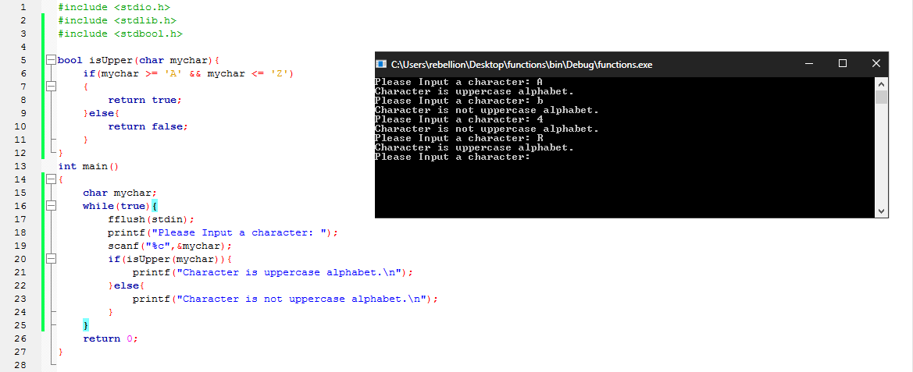
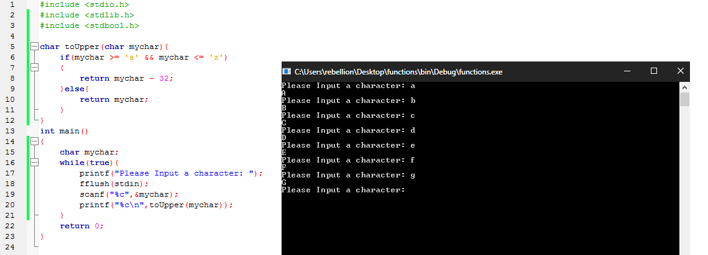
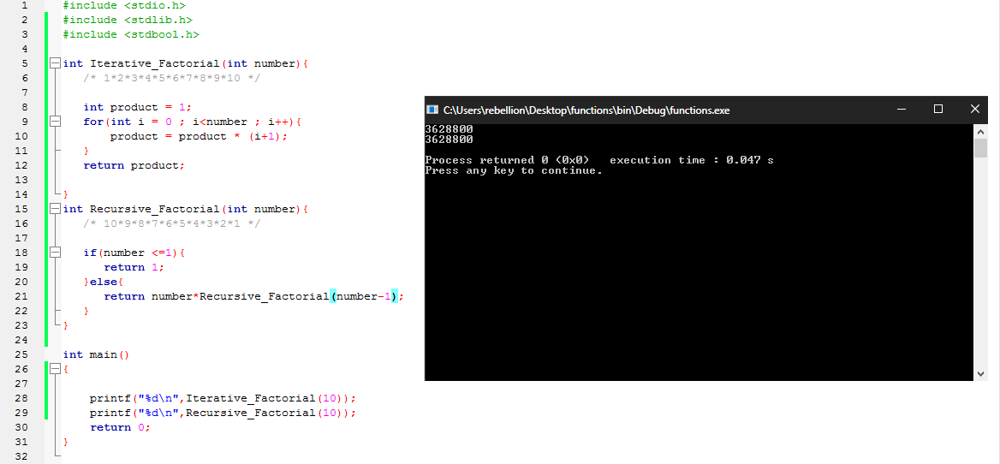

### ==الدوال Functions==

> الدوال هي طريقة لتقسيم البرنامج و تنظيمه و اعادة استخدام اجزائه بدون الحاجة الي اعادة كتابة نفس الأكواد مما يمكن المبرمج من بناء برامج اكثر تعقيدا بستخدام دوال انشئها بنفسه او قام بإنشائها مبرمجين اخرين لتأدية وظيفة محددة او عدة وظائف مع توفير كم كبير من الوقت. 

و يجب تعريف الدوال قبل استخدامها حيث يتضمن ذلك التعريف 

- نوع البيانات المرجعة 
- اسم الدالة
- نوع و عدد الوسائط

و هناك طريقتين لتعريف الدالة، الأولي كتابة الـ  function definition كما في الدالة الرئيسية `main` حيث يتم تعريف الدالة بكل ما تحتويه مرة واحدة و يتضمن ذلك رأس الدالة function header و محتوي الدالة function body/function block.  في هذه الحالة يجب ان يكون مكان الدالة داخل الملف المصدري source code قبل اي استخدام لها. مثال:

```c
#include <stdio.h>
#include <stdlib.h>

int sum(int num1,int num2) /* function header */
/* function block start */
{
    return num1 + num2;
}
/* function block end */

int main(void) /* function header */
/* function block start */
{
    printf("%d\n",sum(5,10));
    return 0;
}
/* function block end */
```


الطريقة الثانية تتضمن تعريف النموذج المبدئي prototype في بداية الملف، و الذي يطابق رأس الدالة function header يتبعه فاصلة منقوطة `;` . و اعادة تعريف الدالة فيما بعد في اي مكان بالملف. هذه الطريقة تعتبر اكثر ملائمة مع البرامج الكبيرة لأنها تعطي في بداية الملف المصدري نبذه عن كل الدوال التي يحتويها. مثال علي الـ prototyping: 

```c
void some_procedure(void);
int string_length(char *str);
double point_distance(double, double, double, double);
```

المثال السابق بطريقة الـ prototyping: 

```c
#include <stdio.h>
#include <stdlib.h>

int sum(int num1,int num2);

int main(void)
{
    printf("%d\n",sum(5,10));
    return 0;
}

int sum(int num1,int num2){
    return num1 + num2;
}
```


#### ==القيم المرجعة return values==

> للدوال انواع بيانات مثلها مثل المتغيرات. و تحدد تلك الانواع القيمة التي يمكن للدالة ان تعيدها حتي يتم استخدامها فيما بعد مع باقي اجزاء البرنامج.

كمثال استخدام `int` في رأس الدالة سيمكننا من اعادة قيمة يمكن تخزينها في متغير بنوع `int` و استخدام `bool` سيمكننا من اعادة قيمة `true` او `false` يمكن استخدامها في العبارات الشرطية. و استخدام `char` يمكننا من اعادة حرف لأخره.. المثال التالي  يوضح استخدام `bool` عن طريق تضمين الملف الرأسي `stdbool.h` و الذي سيقوم بتعريف القيم `bool` `true` `false` بدون الحاجة لتعريفها بأنفسنا بالشكل التالي:

```c
#define bool int
#define true 1
#define false 0
```

```c
#include <stdio.h>
#include <stdlib.h>
#include <stdbool.h>

bool isUpper(char mychar){
    if(mychar >= 'A' && mychar <= 'Z')
    {
        return true;
    }else{
        return false;
    }
}

int main()
{
    char mychar;
    while(true){
        fflush(stdin);
        printf("Please Input a character: ");
        scanf("%c",&mychar);
        if(isUpper(mychar)){
            printf("Character is uppercase alphabet.\n");
        }else{
            printf("Character is not uppercase alphabet.\n");
        }
    }
    return 0;
}

```



لاحظ كيف تقوم الدالة `isUpper` بتحديد ما إذا كان الوسيط `mychar` حرفا كبيرا uppercase letter و علي ذلك تقوم بإعادة `true` او `false` و عن طريق ذلك يمكننا تحديد الجملة التي سيتم طباعتها. المثال التالي يستخدم النوع `char` في تحويل حرف صغير lowercase letter الي حرف كبير uppercase من ثم إعادته عن طريق الكلمة المحجوزة `return` :

```c
#include <stdio.h>
#include <stdlib.h>
#include <stdbool.h>

char toUpper(char mychar){
    if(mychar >= 'a' && mychar <= 'z')
    {
        return mychar - 32;
    }else{
        return mychar;
    }
}
int main()
{
    char mychar;
    while(true){
        printf("Please Input a character: ");
        fflush(stdin);
        scanf("%c",&mychar);
        printf("%c\n",toUpper(mychar));
    }
    return 0;
}
```




#### ==العودية recursion==

> الدوال في لغة C دوال عودية recursive مما يعني انها قادرة علي استدعاء نفسها.

 و العودية تعتبر اقل فاعلية من استخدام حلقات التكرار مع ذلك قد توفر في بعض الاحيان سهولة في قراءة و كتابة البرنامج. المثال التالي يوضح الفرق بين حساب المضروب factorial بستخدام حلقات `for` و بستخدام العودية recursion:

```c
#include <stdio.h>
#include <stdlib.h>
#include <stdbool.h>

int Iterative_Factorial(int number){
   /* 1*2*3*4*5*6*7*8*9*10 */

   int product = 1;
   for(int i = 0 ; i<number ; i++){
       product = product * (i+1);
   }
   return product;

}
int Recursive_Factorial(int number){
   /* 10*9*8*7*6*5*4*3*2*1 */

   if(number <=1){
      return 1;
   }else{
      return number*Recursive_Factorial(number-1);
   }
}

int main()
{

    printf("%d\n",Iterative_Factorial(10));
    printf("%d\n",Recursive_Factorial(10));
    return 0;
}

```




#### ==المكتبة القياسية The Standard Library==

المكتبة القياسية في لغة C تمتلك عدد كبير من الدوال ( حوالي 145 ) و التي توفر العديد من الوظائف المستخدمة في اغلب البرامج بشكل عام. كما تعطي دوال المكتبة القياسية مثالا عن كيفية بناء دوال تعتمد بشكل قليل علي غيرها و محددة في وظائفها و واضحة في طريقة استخدامها. لن يتم التعمق في دوال المكتبة القياسية ولكن ينصح بشدة التعرف عليها بتفصيل و استخدامها قبل كتابة الدوال الخاصة بك. يمكنك التعرف اكثر علي دوال المكتبة القياسية من هنا: http://www.cplusplus.com/reference/clibrary/  او للغة العربية هناك مكتبة كاملة من الكتب عن لغة C هنا: https://www.kutub.info/library/category/20.