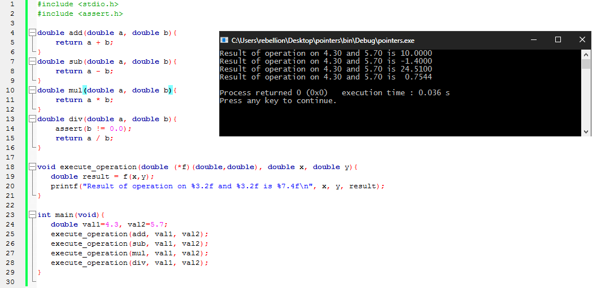
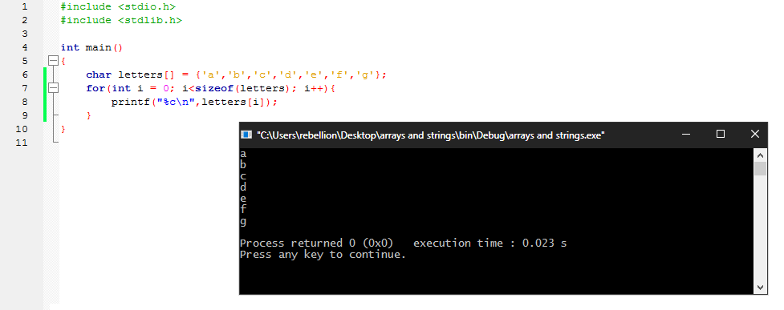
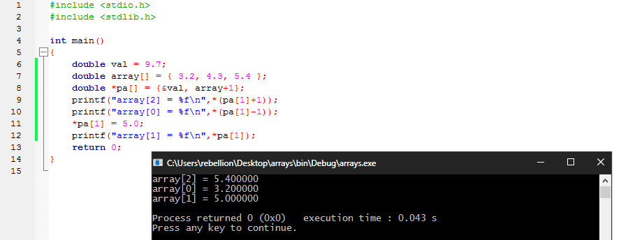
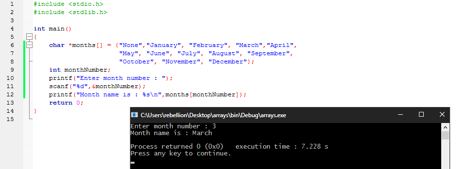
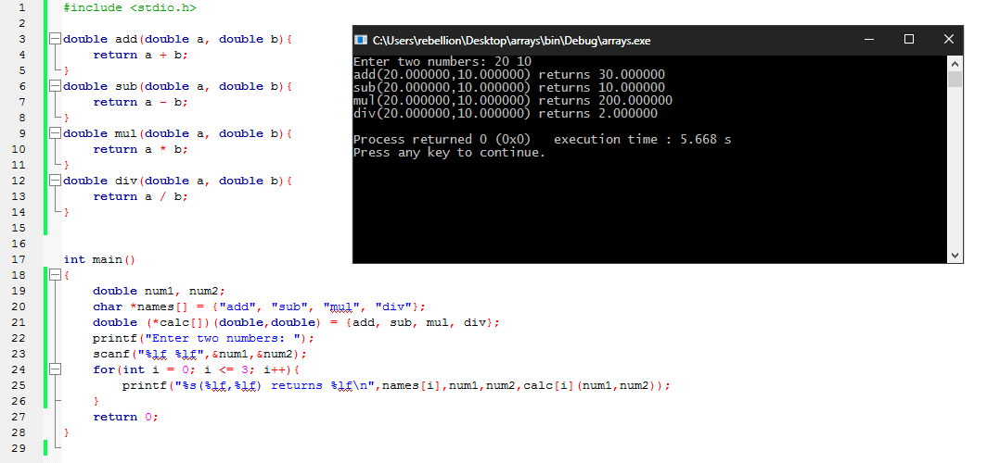
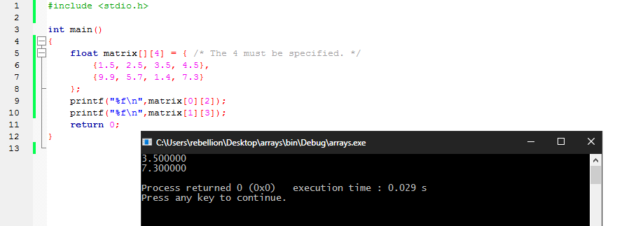
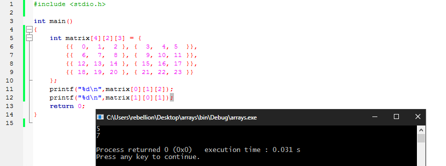

### ==المؤشرات Pointers==

> المؤشر هو متغير يحمل عنوان الذاكر الخاص بمتغير أخر. و توفر المؤشرات طريقة مباشرة للتعديل و الوصول للبيانات في الذاكرة. و يتم اعتبار تلك الخاصية احد اقوي الخصائص في لغة C. و طريقة الإعلان عن مؤشر تكون مماثلة لطريقة الإعلان عن متغير. الفرق الوحيد هي العلامة `*` بين نوع المؤشر و اسمه.


و يحدد حجم المؤشر القيمة التي يمكنه تخزينها و التعامل معها، مثال مؤشر بحجم `16Bit` يمكنه التعامل مع عناوين الذاكرة بين `0` لـ `65535` و مؤشر بحجم `32Bit` يمكنه التعامل مع عناوين بين `0` لـ `4294967295`.  المثال  التالي يوضح الشكل العام للمؤشرات:

```c
int i = 2;
int *j = &i; /* Define a pointer-to-int j, and initialise with address of i. */
int x = *j; /* x is assigned the value of i (that is, 2). */
```

```c
char c = ’A’;
char *pc = &c; /* pc points to c */
```

لاحظ كيف تتشابه أنواع المؤشرات مع انواع المتغيرات المُشار اليها حيث انه من الخطأ استخدام المؤشرات للإشارة لأنواع مختلفة من البيانات بدون استخدام الـ casts, مثال:

```c
float i = 2.f;
unsigned long *p1 = &i; /* Error: type mismatch, won’t compile. */
unsigned long *p2 = (unsigned long *)&i; /* OK, but strange. */
```

المثال التالي يشرح استخدام المؤشرات في تعيين قيمة جديدة للمتغير.

```c
#include <stdio.h>
#include <stdlib.h>

int main()
{
    int *ptr, i;
    i = 10;
    ptr = &i;
    *ptr = 100;
    printf("Value %d has the address 0x%x in memory.\n",i,ptr);
    printf("Value %d has the address 0x%x in memory.\n",*ptr,ptr);
    printf("Value %d has the address 0x%x in memory.\n",*ptr,&i);
    return 0;
}
```


لاحظ كيف يمكننا:

- امكانية الوصول لعناون الذاكرة الخاصة بالمؤشر عن طريق كتابة اسمه بشكل مباشر
-  امكانية الوصول لعنوان الذاكرة الخاص بالمتغيرات عن طريق اضافة `&` قبل اسمها 
-  تغير قيمة او الوصول لقيمة المُشار إليه عن طريق اضافة `*` قبل اسم المؤشر فيما يعرف بالـ **Dereferencing** و يعني الوصول للقيمة المُخزنة في الذاكرة المُشار اليها من قبل المُؤشر


> ترتبط المؤشرات و المصفوفات بقوة حيث انه كلما تم التعريف عن مصفوفة تم تحويلها تلقائيا إلي مؤشر يشير الي عنوان عنصرها الأول.

و بستخدام المؤشرات يمكننا التنقل بين البيانات داخل الذاكرة فكمثال يمكننا بإضافة `1` لمؤشر يشير الي مصفوفة ان نتقدم بين عناصرها كما في المثال التالي: 

```c
#include <stdio.h>
#include <stdlib.h>

int main()
{
    char mychar[] = "HELLO";
    char *myptr = &mychar;
    for(int i=0; i<6; i++){
        printf("%c\n",*myptr++);
    }
    return 0;
}
```


كما يمكننا استبدال المصفوفات بالمؤشرات لتخزين النصوص كما في المثال التالي:

 ```c
#include <stdio.h>
#include <stdlib.h>

int main()
{
    char *mystring = "HELLO";
    for(int i=0; i<6; i++){
        printf("%c\n",*(mystring+i));
    }
    printf("%s\n",mystring);
    return 0;
}
 ```


لاحظ استخدامنا ```(mystring+i)*``` بدلا من ```++mystring*``` حتي لا نزيد من قيمة المؤشر فيشير الي قيمة أخري في الذاكرة. المثال التالي يوضح ما يمكن ان يحدث في حالة استخدمنا ```++mystring*```:

```c
#include <stdio.h>
#include <stdlib.h>

int main()
{
    char *mystring = "HELLO";
    char *string = "SomeStringAfter";
    for(int i=0; i<6; i++){
        printf("%c\n",*mystring++);
    }
    printf("%s\n",mystring); /* mystring is now pointing to string */
    return 0;
}

```


لاحظ الأن `mystring` اصبح يشير الي قيمة `string` في الذاكرة بعد الإنتهاء من تنفيذ الحلقة، يظهر ذلك عند محاولة طباعة ما يحتويه والذي تغير ليساوي `SomeStringAfter` بدلا من `HELLO`. 


> عندما يتم تمرير المتغير المحلي الخاص بدالة إلي دالة أخري فإنه يتم دائما تمرير قيمته إلي وسيط الدالة pass by value. نتيجة لذلك، اي عملية تتم بستخدام الوسيط تبقي في النطاق المحلي للدالة و لا تؤثر علي قيمة المتغير الذي تم تمرير قيمته. 

مع ذلك بستخدام المؤشرات يمكننا التعديل علي المتغيرات المحلية بستخدام عنوانها في الذاكرة و يسمي ذلك النوع من تمرير الوسائط pass by reference. المثال التالي يمرر عنوان الذاكرة الخاص بالمتغير `num` للمؤشر الوسيط `ptr` من ثمة يتم التعديل علي القيمة داخل عنوان الذاكرة المُشار إليه. 

```c
#include <stdio.h>
#include <stdlib.h>

void increment(int *ptr){
    *ptr = 20;
}

int main()
{
    int num = 10;
    increment(&num);
    printf("%d\n",num);
    return 0;
}

```


و يفتح استخدام المؤشرات للتعديل علي البيانات الباب للكثير من الأفكار البرمجية التي تسهل كتابة برامج اكثر تعقيدا. كمثال يمكننا تمثيل الدالة `strcpy` و هي احدي دوال المكتبة القياسية و تقوم بنسخ نص من متغير الي متغير اخر في الشكل التالي:

```c
#include <stdio.h>
#include <stdlib.h>

void strcpy (char *destination, char *source){
    while ((*destination = *source) != '\0') {
        ++source;
        ++destination;
    }
}

int main()
{
    char str1[100];
    char str2[] = "Hello World";
    strcpy(str1,str2);
    printf("%s\n",str1);
    return 0;
}

```


لاحظ كيف كتبنا الشرط الخاص بحلقة `while` ليكون غير صحيح في حالة كان `source*` يساوي `0\` هذا بسبب ان النصوص تنتهي بعلامة null terminator داخل الذاكرة،  بمعني ان النص `Hello World` يتم التعامل معه علي انه `Hello World\0` و عن طريق ذلك يمكننا إدراك متي ينتهي النص كما تم في حلقة `while`.


يمكننا تعيين مؤشرات للدوال كذلك، و بستخدام المؤشرات للدوال يمكننا تمرير الدوال كوسائط لدوال اخري او الجمع بين عدة مؤشرات للدوال في مصفوفة واحدة و استخدامها لإستدعاء الدالة حسب موقعها في تلك المصفوفة، المثال التالي يوضح استخدم مؤشرات الدوال `add` `sub` `mul` `div`   لتمريرها كوسائط للدالة `execute_operation`.

```c
#include <stdio.h>
#include <assert.h>

double add(double a, double b){
    return a + b;
}
double sub(double a, double b){
    return a - b;
}
double mul(double a, double b){
    return a * b;
}
double div(double a, double b){
    assert(b != 0.0);
    return a / b;
}

void execute_operation(double (*f)(double,double), double x, double y){
   double result = f(x,y);
   printf("Result of operation on %3.2f and %3.2f is %7.4f\n", x, y, result);
}

int main(void){
   double val1=4.3, val2=5.7;
   execute_operation(add, val1, val2);
   execute_operation(sub, val1, val2);
   execute_operation(mul, val1, val2);
   execute_operation(div, val1, val2);
}

```




### ==المصفوفات و النصوص Arrays and Strings== 

> المصفوفات هي مجموعة من المتغيرات تشترك في نوع البيانات ذاته و تشغل منطقة متصلة في الذاكرة. و تبدأ فهرسة تلك المتغيرات من الرقم `0`.

كما في اي نوع اخر من المتغيرات،  يمكن للمصفوفات ان تكون محلية او خارجية او ذات نطاق ثابت. و المصفوفات ذات النطاق الثابت تمتلك قيمة مبدئية تساوي `0` اما بالنسبة للمصفوفات ذات النطاق المحلي فلا تمتلك قيمة مبدئية و تحتوي علي قيم عشوائية. و تأخذ المصفوفات الشكل التالي: 

```c
Type name[SIZE] = { element1, element2, element3, element4 };
```

ان كان عدد القيم المستخدمة في المصفوفة اقل من الحجم المحدد لها فسيتم تعين باقي العناصر لتساوي `0` و لكن لا يمكن ان يتعدي عدد عناصر المصفوفة حجمها،  و في حالة عدم تحديد عدد عناصر الدالة فسيتم تعينها بشكل ديناميكي لتناسب عدد عناصر المصفوفة،  مثال:

```c
int arr1[12] = { 31, 28, 31, 30, 31, 30, 31, 31, 30, 31, 30, 31 }; /* valid */
int arr2[] = { 31, 28, 31, 30, 31, 30, 31, 31, 30, 31, 30, 31 }; /* valid */
int arr3[1] = { 31, 28, 31, 30, 31, 30, 31, 31, 30, 31, 30, 31 }; /* ERORR */
```

المثال التالي يوضح استخدام المؤثر `sizeof` لمعرفة عدد عناصر الدالة في جملة شرطية داخل حلقة `for`:

```c
#include <stdio.h>
#include <stdlib.h>

int main()
{
    char letters[] = {'a','b','c','d','e','f','g'};
    for(int i = 0; i<sizeof(letters); i++){
        printf("%c\n",letters[i]);
    }
}
```



لاحظ كيف يمكننا الوصول الي القيم داخل المصفوفة عن طريق استخدام الرقم التسلسلي الخاص بقيمة معينة فالقيمة `a` تمتلك الرقم التسلسلي `0` لأنها اول عنصر داخل المصفوفة يليها القيمة `b` بالرقم `1` و هكذا ..

و تمتلك المصفوفات من النوع `char` خصائص تميزها بسبب علاقتها بالنصوص. فكمثال يمكننا التعريف عن نص بستخدام المصفوفات بالشكل التالي.

 ```c
#include <stdio.h>
#include <stdlib.h>

int main()
{
   char hello[] = "Hello";
   printf("sizeof(hello) = %d, content of hello = %s\n",sizeof(hello),hello);
   return 0;
}

 ```


لاحظ حجم المصفوفة يساوي `6` و ليس `5` بسبب ان النصوص تنتهي بـ `0\` مما يضيف عنصرا جديدا للمصفوفة بشكل تلقائي،  هذا يساوي كتابة البرنامج السابق علي الشكل التالي. 

```c
#include <stdio.h>
#include <stdlib.h>

int main()
{
   char hello[] = {'a', 'b', 'c', 'd', 'e', '\0'};
   printf("sizeof(hello) = %d, content of hello = %s\n",sizeof(hello),hello);
   return 0;
}

```

و استخدام المصفوفات بهذا الشكل يتيح لنا التعديل علي قيم المتغيرات داخلها كما في المثال التالي:

```c
#include <stdio.h>
#include <stdlib.h>

int main()
{
   char hello[] = "abcde";
   hello[1] = 'D';
   printf("sizeof(hello) = %d, content of hello = %s\n",sizeof(hello),hello);
   return 0;
}

```


 يمكننا كذلك تعيين مؤشر لثابت نصي،  في تلك الحالة لن يمكننا التعديل علي قيمة النص بعد تعينه هذا بسبب ان الثوابت النصية تمتلك مدي ثابت ( يتم تخصيص مساحة المصفوفة في الذاكرة قبل بدئ تنفيذ البرنامج و تبقي تلك المساحة حتي انتهاء تنفيذه في الذاكرة ) و يشير مؤشر الثابت النصي الي بداية تلك المصفوفة،  مثال:

```c
#include <stdio.h>
#include <stdlib.h>

int main()
{
   char *hello = "abcde";
// hello[1] = 'D'; /* ERORR */
   printf("sizeof(hello) = %d, content of hello = %s\n",sizeof(hello),hello);
   return 0;
}
```

و تفيد المؤشرات للثوابت النصية في امكانية استخدام النصوص بعد انتهاء الدالة. المثال التالي يوضح كيفية تعيين القيمة المرجعة للدالة `retStr` لتكون مؤشر لثابت نصي و استخدامه خارج نطاق الدالة. 

```c
#include <stdio.h>
#include <stdlib.h>


char *retStr(void){
   char *hello = "Hello World\n";
   return hello;
}

int main(void)
{
   char *hello = retStr();
   printf("%s\n",hello);
   return 0;
}

```


#### ==مصفوفات من المؤشرات Arrays of Pointers== 

نظرا لأن المؤشرات مجرد نوع من المتغيرات، يمكننا تخزينها داخل مصفوفات تماما كأي متغيرات آخري. في المثال التالي تم تعيين المصفوفة `pa` لتحمل داخلها العنصرين `val&` و ` array+1` من ثم قمنا بطباعة قيمة هذين العنصرين. 

```c
#include <stdio.h>
#include <stdlib.h>

int main()
{
    double val = 9.7;
    double array[] = { 3.2, 4.3, 5.4 };
    double *pa[] = {&val, array+1};
    printf("val = %f\n",*pa[0]);
    printf("array[1] = %f\n",*pa[1]);
    return 0;
}

```


الأمر لا يتوقف هنا حيث يمكننا التعديل و التلاعب بالقيم التي تشير إليها المؤشرات مثل اي مؤشرات عادية، مثال:

```c
#include <stdio.h>
#include <stdlib.h>

int main()
{
    double val = 9.7;
    double array[] = { 3.2, 4.3, 5.4 };
    double *pa[] = {&val, array+1};
    printf("array[2] = %f\n",*(pa[1]+1));
    printf("array[0] = %f\n",*(pa[1]-1));
    *pa[1] = 5.0;
    printf("array[1] = %f\n",*pa[1]);
    return 0;
}

```



و من اشهر استخدامات المصفوفات من المؤشرات هو استخدامها لعمل مصفوفات من الثوابت النصية. كمثال، البرنامج التالي يقوم بأخذ رقم من المستخدم و طباعة اسم الشهر الموافق لهذا الرقم:

```c
#include <stdio.h>
#include <stdlib.h>

int main()
{
    char *months[] = {"None","January", "February", "March","April",
                      "May", "June", "July", "August", "September",
                      "October", "November", "December"};
    int monthNumber;
    printf("Enter month number : ");
    scanf("%d",&monthNumber);
    printf("Month name is : %s\n",months[monthNumber]);
    return 0;
}
```




مثال آخر شائع هو تخزين مؤشرات لمجموعة دوال تتشارك في نفس نوع و عدد الوسائط و نفس القيمة المرجعة و يتم استدعاء الدوال بناء علي موقع فهرستها داخل المصفوفة، المثال التالي يوضح الشكل العام للتعريف عن مصفوفة من مؤشرات الدوال:

```c
int (*pf[10])(char *);
```

السطر السابق يقوم بتعريف المتغير `pf`، و الذي يمثل مصفوفة من مؤشرات الدوال التي تتوافق في نوع و عدد الوسائط و القيمة المرجعة، كل دالة تأخذ وسيط بنوع البيانات `* char` و تقوم بإرجاع `int`. 

المثال التالي يوضح استخدام مصفوفة من مؤشرات الدوال لكتابة آلة حاسبة بسيطة. كل دالة داخل المصفوفة تأخذ وسيطين من نوع `double` و تقوم بإعادة قيمة من نفس النوع. 

```c
#include <stdio.h>

double add(double a, double b){
    return a + b;
}
double sub(double a, double b){
    return a - b;
}
double mul(double a, double b){
    return a * b;
}
double div(double a, double b){
    return a / b;
}

int main()
{
    double num1, num2;
    char *names[] = {"add", "sub", "mul", "div"};
    double (*calc[])(double,double) = {add, sub, mul, div};
    printf("Enter two numbers: ");
    scanf("%lf %lf",&num1,&num2);
    for(int i = 0; i <= 3; i++){
        printf("%s(%lf,%lf) returns %lf\n",names[i],num1,num2,calc[i](num1,num2));
    }
    return 0;
}

```




#### ==المصفوفات متعددة الأبعاد Multi-dimensional Arrays==

> توفر لغة C مصفوفات متعددة الأبعاد رغم ذلك هي أقل استخدام بكثير من المصفوفات للمؤشرات. و تختلف خصائص المصفوفات متعددة الأبعاد عن المصفوفات للمؤشرات حيث تشغل المصفوفات متعددة الأبعاد منطقة متجاورة و واحدة من الذاكرة، بينما قد تشير مصفوفة من المؤشرات الي مواقع مختلفة من الذاكرة. و تختلف المصفوفات متعددة الأبعاد كذلك في ان كل صف داخلها له نفس الحجم بينما قد تشير المصفوفات للمؤشرات الي مصفوفات بأحجام مختلفة. و عند تعريف مصفوفة متعددة الأبعاد يجب تحديد حجم الصفوف داخلها بينما لا تتطلب المصفوفات للمؤشرات ذلك الشرط. 
> الخلاصة ان المصفوفات للمؤشرات عادة ما تكون اكثر مرونة و كفائة لهذا يتم استخدامها اكثر من المصفوفات متعددة الأبعاد.

يتم التعريف عن المصفوفات متعددة الأبعاد بستخدام أقواس مربعة متجاورة، وبالنسبة للعناصر داخل المصفوفة فتكون داخل أقواس مجعدة. المثال التالي يوضح إنشاء مصفوفة متعددة الأبعاد و الوصول للعناصر داخلها: 

```c
#include <stdio.h>

int main()
{
    float matrix[][4] = { /* The 4 must be specified. */
        {1.5, 2.5, 3.5, 4.5},
        {9.9, 5.7, 1.4, 7.3}
    };
    printf("%f\n",matrix[0][2]);
    printf("%f\n",matrix[1][3]);
    return 0;
}

```



لاحظ امكانية ترك الأقواس الأولي فارغة بدون قيمة. مع ذلك،  يلزم تحديد الحجم لباقي الصفوف داخل المصفوفة. و يمكن للمصفوفات متعددة الأبعاد ان تمتلك اي عدد من الأبعاد، مثال:

```c
#include <stdio.h>

int main()
{
    int matrix[4][2][3] = {{{  0,  1,  2 }, {  3,  4, 5  }},{{  6,  7,  8 }, {  9, 10, 11 }},{{ 12, 13, 14 }, { 15, 16, 17 }},{{ 18, 19, 20 }, { 21, 22, 23 }}};
    printf("%d\n",matrix[0][1][2]);
    printf("%d\n",matrix[1][0][1]);
    return 0;
}

```


