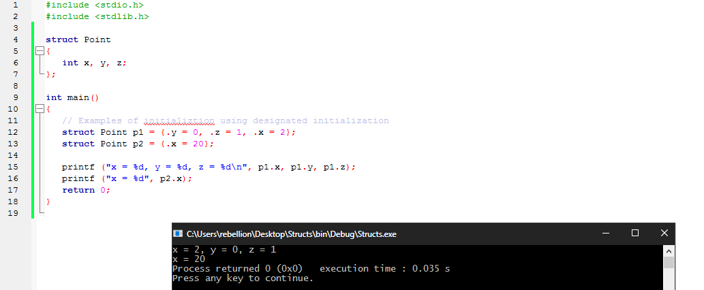
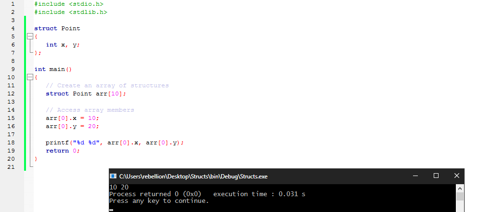
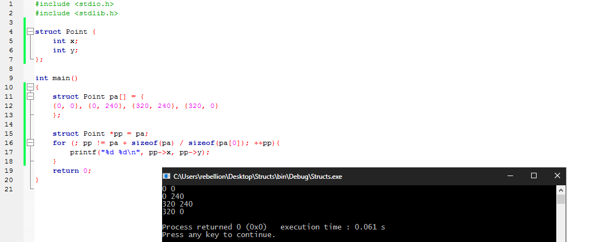

### ==التراكيب و التجمعيات Structures and Unions==

> تسمح التراكيب بإنشاء أنواع مٌعرفة من قبل المستخدم user-defined types و تتضمن تلك الانواع مجموعة من المتغيرات التي قد تكون من انواع مختلفة سواء من الأنواع الأساسية في لغة C او انواع آخري مُعرفة من قبل المستخدم تحت اسم واحد ليسهل التعامل معها و ادارتها، و تساهم التراكيب بدور كبير في إنشاء برمجيات معقدة و ضخمة، فهي تسمح بمعالجة البيانات ذات الصلة كوحدة واحدة بدلا من التعامل معاها ككيانات منفصلة موفرة سهولة في قراءة و التعديل علي الملف المصدري و طرق افضل و اسرع لحل المشاكل المعقدة.

يتم تعريف التراكيب بستخدام الكلمة المحجوزة `struct`، و يتم التعريف عن المتغيرات داخل الـ Block الخاص بالتراكيب علي النحو التالي: 

```c
struct StructName 
{ 
   char var1[50]; 
   char var2[100]; 
   char var3[50]; 
   char var4[20]; 
   int var5; 
   double var6;
};
```

المثال التالي يقوم بإنشاء تركيب بسيط مكون من متغيريين من النوع `int`: 

```c
struct Point {
	int x;
	int y;
};
```

و يشار الي المتغيرات داخل التركيبة ( في هذه  الحالة المتغيريين `x` `y` ) علي انهم اعضاء members في التركيبة `Point`.

و يمكن إنشاء متغيرات من نوع التركيبة في نهاية الـ Block الخاص بها كالتالي: 

```c
struct Point {
	int x;
	int y;
} p1, p2, p3; /* Define three variables of type Point. */
```

او تعريفها لاحقا بستخدام الكلمة المحجوزة `struct` يليها اسم التركيبة و اسماء المتغيرات من نوع التركيبة علي النحو التالي: 

```c
struct Point p1, p2, p3; /* Define three variables of type Point. */
```

كما يمكننا إعطاء قيمة للمتغيرات داخل التركيبة علي النحو التالي:

```c
struct Point topleft = { 320, 0 };
```

مما سينتج عنه إعطاء قيمة للمتغيرات حسب ترتيب التعريف عنها داخل التركيبة، فهنا علي سبيل المثال سيساوي المتغير `x` القيمة `320` و `y` القيمة `0`. 
مع ذلك يمكن تخطي الإلتزام بالترتيب لإعضاء المصفوفة بستخدام التهيئة المخصصة و التي يشار اليها بإسم Designated Initialization،  تأخذ الشكل التالي: 

```c
.var5 = val, .var1 = val2 ... 
```

المثال التالي يوضح استخدام الـ Designated initialization:

```c
#include <stdio.h>
#include <stdlib.h>

struct Point
{
   int x, y, z;
};

int main()
{
   // Examples of initialization using designated initialization
   struct Point p1 = {.y = 0, .z = 1, .x = 2};
   struct Point p2 = {.x = 20};

   printf ("x = %d, y = %d, z = %d\n", p1.x, p1.y, p1.z);
   printf ("x = %d", p2.x);
   return 0;
}

```




كما يمكننا استخدام المؤثر الخاص بالأعضاء  `.` للوصول للمتغيرات علي النحو التالي: 

```c
struct Point topleft;
topleft.x = 320;
topleft.y = 0;
```


مع ذلك لا يمكننا تعيين قيمة لأعضاء التركيبة داخلها مثال:

```c
struct Point 
{ 
   int x = 0;  // COMPILER ERROR:  cannot initialize members here 
   int y = 0;  // COMPILER ERROR:  cannot initialize members here 
};  
```

السبب في ذلك انه عند التعريف عن انواع البيانات لا يتم تخصيص عنواين ذاكرة لها. ولكن يتم فقط تخصيص الذاكرة عندما يتم استخدام التراكيب للتعريف عن متغيرات من نوعها. 

اما بالنسبة للعمليات المسموح إجرائها علي التراكيب فهي نفسها العمليات المسموح بها للأنواع الأساسية مثل `int` او `double` فقد يتم نسخ التركيبة او تعيين قيمة متغيراتها لكن لا يمكن مقارنة تركيبين بشكل مباشر، يمكن كذلك تمرير التراكيب كوسائط للدوال و إعادتها كقيمة مرجعة، مثال:

```c
#include <stdio.h>
#include <stdlib.h>

struct Point {
	int x;
	int y;
};

struct Point point_difference(struct Point p1, struct Point p2)
/* Return the delta (dx, dy) of p2 with respect to p1. */
{
    p2.x -= p1.x;
    p2.y -= p1.y;
    return p2;
}

int main()
{
    struct Point p1 = {.x = 5, .y = 10};
    struct Point p2 = {.x = 30, .y = 20};
    struct Point p3 = point_difference(p1,p2);
    printf("p3.x = %d, p3.y = %d\n",p3.x,p3.y);
    return 0;
}
```
و كما هو الحال مع اي متغير آخر يتم تمرير التراكيب حسب القيمة pass by value كما في المثال اعلاه مع وسائط الدالة `point_difference`

```c
struct Point point_difference(struct Point p1, struct Point p2)
```

مما سيترتب عليه كون التعديل علي قيمة `p2` داخل الدالة غير مؤثر علي قيمتها خارج الدالة. مع ذلك يمكن ان يكون تمرير التراكيب حسب القيمة غير فعال إذا كانت التراكيب كبيرة. و بشكل عام يكون تمرير مؤشر للتركيبة اكثر فاعلية من عمل نسخة منها. و الحصول علي عنوان متغير تابع للتركيبة يتشابه مع الطريقة العادية التي يتم استخدامها مع الأنواع الأساسية، مثال:

```c
#include <stdio.h>
#include <stdlib.h>

struct Point {
	int x;
	int y;
};

int main()
{
    struct Point pt = { 50, 50 };
    struct Point *pp;
    pp = &pt;
    (*pp).x = 100; 
    printf("%d\n",pt.x); // pt.x is now 100
    return 0;
}

```

و يتم استخدام العلامة `<-` علي النحو التالي لتبسيط استخدام مؤشرات التراكيب:

```c
#include <stdio.h>
#include <stdlib.h>

struct Point {
	int x;
	int y;
};

int main()
{
    struct Point pt = { 50, 50 };
    struct Point *pp = &pt;
    pp->x = 100;
    printf("%d\n",pp->x); // pt.x is now 100
    return 0;
}
```


#### ==مصفوفات من التراكيب Arrays of Structures==

كما في الأنواع الأساسية، يمكن إنشاء مصفوفات من التراكيب علي الشكل التالي.

```c
#include <stdio.h>
#include <stdlib.h>

struct Point
{
   int x, y;
};

int main()
{
   // Create an array of structures
   struct Point arr[10];

   // Access array members
   arr[0].x = 10;
   arr[0].y = 20;

   printf("%d %d", arr[0].x, arr[0].y);
   return 0;
}

```



في المثال السابق قمنا بإنشاء مصفوفة من عشر عناصر من نوع التركيب `Point`، مما يعني ان لكل عنصر من العشرة عناصر المتغيرين `x` و `y` الخاصين بيه.
 كذلك يمكننا تعيين قيمة للعناصر اثناء التعريف عن المصفوفة عن طريق وضعها بين `{}` كما انه لا يلزم تحديد حجم معين للمصفوفة و تركها ليتم تعيين قيمتها بشكل ديناميكي. المثال التالي ينشيء مصفوفة من نوع التركيب `Point` بحجم اربعة عناصر و يقوم بطباعة القيم الخاصة بكل عنصر.

```c
#include <stdio.h>
#include <stdlib.h>

struct Point {
	int x;
	int y;
};

int main()
{
    struct Point pa[] = {
    {0, 0}, {0, 240}, {320, 240}, {320, 0}
    };

    struct Point *pp = pa;
    for (; pp != pa + sizeof(pa) / sizeof(pa[0]); ++pp){
        printf("%d %d\n", pp->x, pp->y);
    }
    return 0;
}

```



لاحظ استخدام `sizeof` لحساب عدد عناصر المصفوفة في المثال السابق:

```c
sizeof(pa) / sizeof(pa[0]) // 4
```


#### ==الكلمة المحجوزة Typedefs==

>  تتشابه الكلمة المحجوزة `typedef` في عملها مع الكلمة المحجوزة `define`، و توفر وسيلة لإنشاء أسماء أنواع بيانات جديدة. `typedef` لا تنشيء انواع جديدة بذاتها، لكنها تضيف اسمًا جديدًا لبعض الأنواع الموجودة.

و تأخذ `typedef` الشكل التالي:

```c
typedef int Length; // Length is now a synonym for int
Length len, maxlen;
Length lengths[50];
```


المثال التالي يقوم بتعريف الأسم `string` لنوع البيانات`*char`

```c
#include <stdio.h>
#include <stdlib.h>

typedef char* string;

int main()
{
   string msg = "Hello world";
   printf("%s\n",msg);
   return 0;
}

```


و تمكنا `typedef` من استخدام التراكيب بشكل افضل حيث انها تلغي الحاجة لإعادة كتابة الكلمة المحجوزة `struct` في كل مرة نقوم بستخدام التراكيب و يتم ذلك علي شكل من الشكلين التاليين:

```c
typedef struct StructName { 
    int var; 
} StructName;
```

```c
struct StructName { 
    int var; 
};
typedef struct StructName StructName;

```

المثال التالي يوضح استخدام `typedef` لإنشاء التركيبة `Point` من ثم استخدامها في دالة ستقوم بإرجاع مؤشر لمساحة تم تخصيصها بستخدام `malloc` من نفس نوع التركيبة:

```c
#include <stdio.h>
#include <stdlib.h>

struct Point
{
  int x, y;
};
typedef struct Point Point;

Point * pointNew(int x, int y)
{
  Point *p;
  if((p = malloc(sizeof *p)) != NULL)
  {
    p->x = x;
    p->y = y;
  }
  return p;
}

int main()
{
   Point *p = pointNew(5,9);
   printf("p->x = %d, p->y = %d\n", p->x, p->y);
   return 0;
}

```


