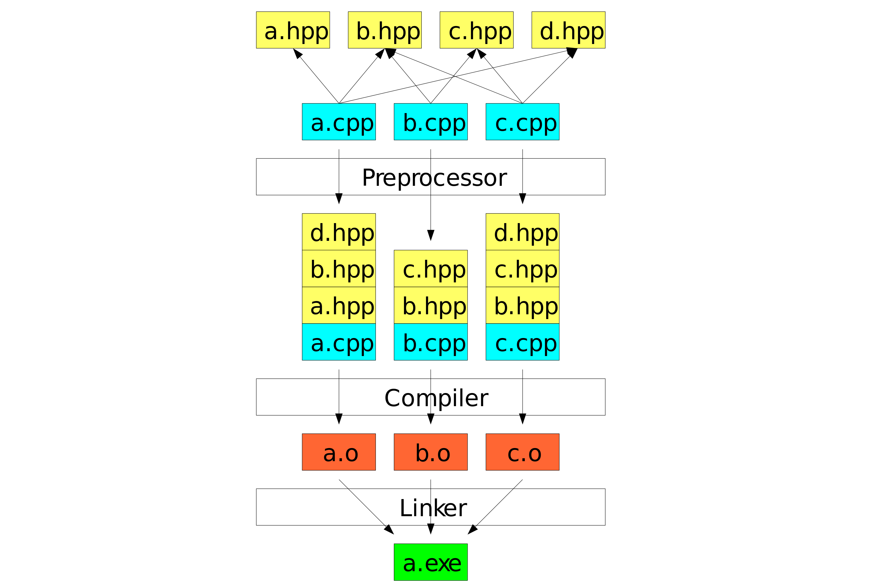
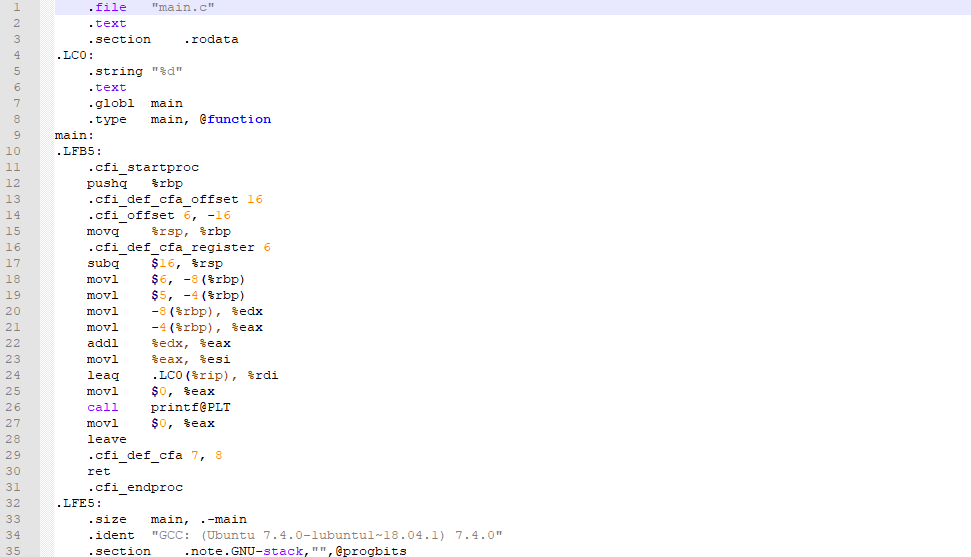

### ==عملية التجميع في لغة C==

> عملية التجميع في لغة C تنقسم الي اربع اجزاء تبدأ من مرحلة ما قبل التجميع  Preprocessing لمرحلة التجميع  Compiling و الـ Assembling  يليهم المرحلة الأخيرة و هي الربط  Linking. تقوم المترجمات بترجمة او تحويل الملفات المصدرية إلي لغة منخفضة المستوي إن لم تكن هناك أخطاء في قواعد اللغة، يمكن تحويل الملفات المصدرية إلي لغة التجميع Assembly Languge أو إلي لغة الألة Machine Languge مباشرة.



في البداية يتم تمرير الملف المصدري للمًجمع Compiler والذي يمثل الواجهة لمكوناته:

- الـ preprocessor المسؤول عن مرحلة ما قبل التجميع  preprocessing في تلك المرحلة تتم عدة عمليات من التحويلات النصية و تبديل النصوص تتضمن تبديل اسماء االملفات الرأسية header files المعرفة عن طريق الموجه `include#` بمحتواها بداخل الملف المصدري  و تبديل كل الثوابت الرمزية symbolic constants المعرفة عن طريق الموجه `define#`  بقيمتها.

- الـ lexical analyser يقوم بعد ذلك بقراءة الملف و تحويل النصوص بداخله لرموز tokens و التأكد من صحة تلك الرموز.


  المثال التالي يوضح كيف سيكون شكل الملف المصدري بعد تضمين الرموز:

```c
int value = 100;
```

```c
int (keyword), value (identifier), = (operator), 100 (constant) and ; (symbol).
```

- الـ parser بعد ذلك سيقوم بأخذ الـ tokens و ترتيبها منطقيا في مجموعات تسمي التعبيرات expressions و يطلق علي هذه التعبيرات غالبا  expression trees

- الـ optimiser وهو مرحلة غير مشروط تواجدها بداخل المجمع في تلك، المرحلة يتم التعديل علي التعبيرات من الـ parser  لإنتاج برنامج اسرع و اصغر حجما

- المجمع بعد ذلك يقوم بتحويل التعبيرات إلي لغة الـ Assembly و هي لغة اقرب للالة منها للبشر و تختلف بختلاف بنية المعالج CPU Archticture الشكل التالي يوضح ما يمكن ان يكون عليه برنامج C بسيط عند تحويله للغة الـ Assembly في معمارية `x86` :




بعد ذلك يأتي دور الـ Assembler و الذي سيترجم ملفات الـ Assembly الي ملفات تحمل تعليمات لغة الألة  و تسمي تلك الملفات بالملفات الكائنية object files.
 اخر خطوة تكون المُربط Linker و فيه يتم دمج  الـ object files مع بعضها البعض و ربطها مع المكتبات التي يتسخدمها البرنامج لإنشاء ملف تنفيذي يمكن تشغيله.


### ==انواع الربط Linking==

> المٌربط Linker يُستخدم لربط اكثر من ملف كائني في ملف تنفيذي واحد و ربط ذلك الملف التنفيذي بالمكتبات التي يستخدمها و ينقسم ذلك النوع من ربط المكتبات بالملف التنفيذي الي نوعين: الربط الثابت  Static Linking و الربط الديناميكي  Dynamic linking و لكل نوع منهم اغراضه و ما يميزه عن الأخر.

#### ==الربط الثابت Static Linking==

في ذلك النوع يتم تضمين كل دوال المكتبة المستخدمة داخل الملف التنفيذي و نتيجة لذلك يكون حجم البرنامج اكبر و يستهلك مساحة اكبر من الذاكرة اثناء تشغيله و لكنه لا يحتاج لوجود المكتبة علي نظام التشغيل ليعمل


#### ==الربط الديناميكي Dynamic Linking==

في ذلك النوع لا يتم ربط الدوال بالملف التنفيذي، عوض ذلك يتم تضمين قائمة الدوال المستخدمة وإضافة تعليمات برمجية تتولي عملية استدعاء المكتبات و ربط الدوال المستخدمة فيها بالملف التنفيذي و يسمي ذلك النوع ايضا بالربط الديناميكي الضمني `Implicit dynamic linking` وهو الأكثر شيوعا و المستخدم بشكل تلقائي في معظم المجمعات.

هناك نوع اخر شائع بين البرمجيات الخبيثة لا يستدعي استخدام المُربط ليعمل و هو نوع الربط الديناميكي الصريح `Explicit Dynamic Linking` و فيه يقوم الملف التنفيذي بتحميل المكتبة و استخدام الدوال داخلها اثناء عملية التشغيل بدون وجود رابط مسبق بينهم و  يسمي ذلك النوع ايضا `Run-Time dynamic linking`. مثال علي الـ`Explicit Dynamic Linking` بستخدام الـ `Windows APIs` (سيتم شرح استخدام الـ Windows APIs تفصيلا عند التطرق لتحليل البرمجيات الخبيثة).

```c
#include <windows.h>

typedef int (WINAPI *MESSAGEBOX)(HWND , LPCSTR, LPCSTR, DWORD);

void main(void)
{
    MESSAGEBOX lpfMsgBox = NULL;
    HINSTANCE hLib;
   
    hLib = LoadLibrary("User32.dll");
    lpfMsgBox = GetProcAddress(hLib,"MessageBoxA");
    lpfMsgBox(0, "Run-Time Dynamic Linking is so cool right?", "Run-Time Dynamic Linking", MB_OK);
}

```


