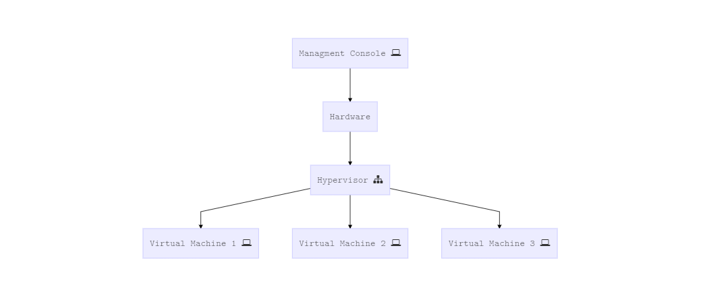
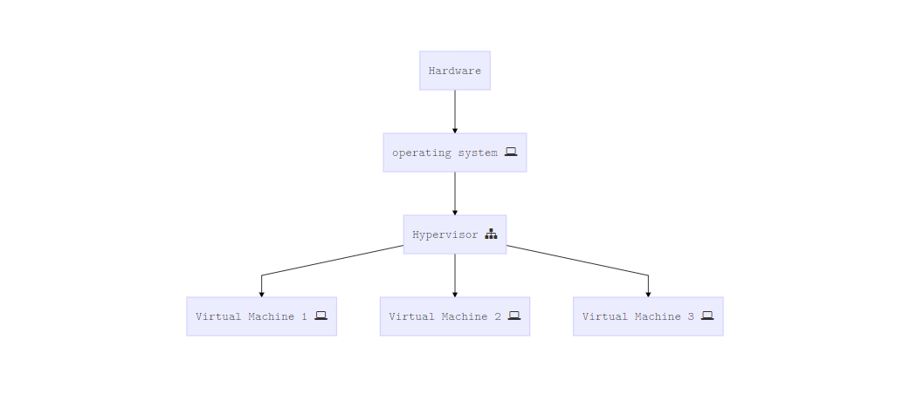
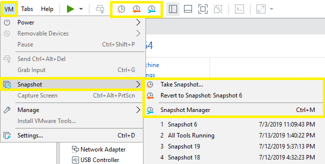
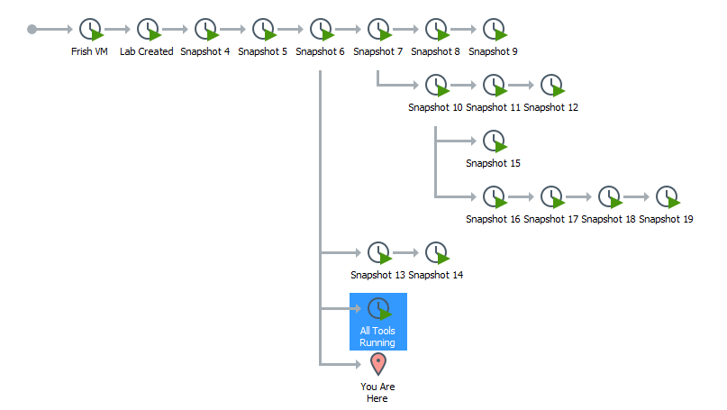
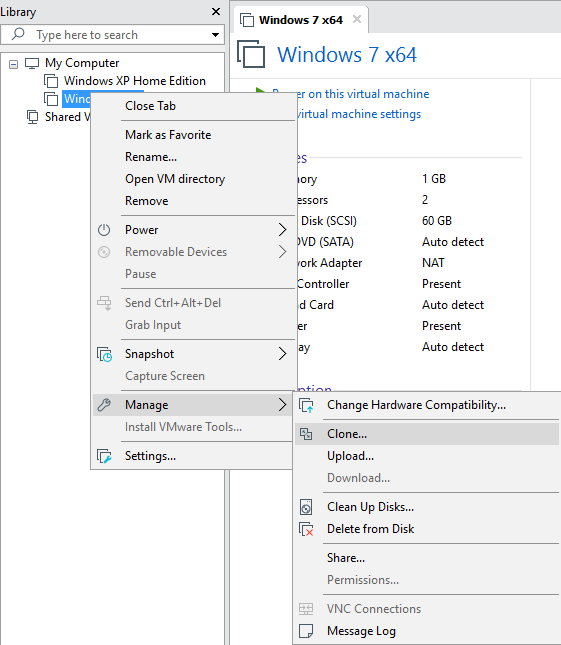
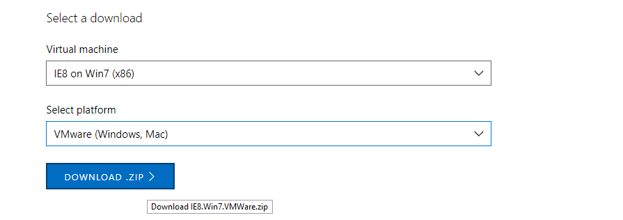
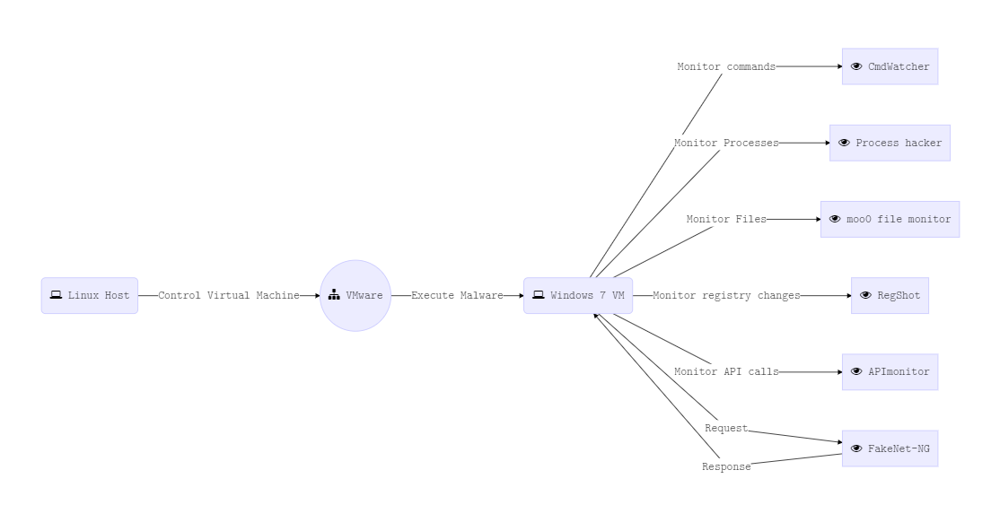

>  الهجمات والحروب الإلكترونية في تزايد مستهدفة الحكومات، القطاعات العسكرية والعامة والخاصة. اغلب تلك الهجمات يتم فيها استخدام البرمجيات الخبيثة Malware للوصول للهدف من حصول على معلومات او بأغراض تخريبية، خلال عملية تحليل تلك البرمجيات يتطلب من المُحلل Analyst ان يمتلك المعرفة والمهارات والادوات المناسبة لفهم والتصدي لتلك الهجمات.

### ==ما هي البرمجيات الخبيثة ؟==

البرمجية الخبيثة او الـ Malware هو برنامج يتم برمجته واستخدامه في اغراض خبيثة وتتعدد صوره فيمكن ان يوجد علي شكل برنامج تنفيذي
 Executable او ملف نصي Script مع اختلاف وتشعب النوعين السابقين حسب لغة البرمجة المستخدمة او البيئة المستهدفة من المهاجم Attacker.
ويمكن للمهاجم ان يستخدم البرمجيات الخبيثة لسرقة معلومات حساسة، التجسس على الأجهزة المصابة والسيطرة على الانظمة، كما يمكنه اعادة نشر
 نفسه عن طريق نقاط اتصال communication channels كالـ Emails او الـ USB devices، والـ Malware هو مصطلح واسع يشير إلى أنواع مختلفة من البرمجيات الخبيثة. وبسبب عمومية ذلك المصطلح يتم أثناء عملية التحليل تصنيف البرمجيات الخبيثة بناءً على وظائفها والطريقة التي تم بها تنفيذ الهجوم. فيما يلي أكثر انواع البرمجيات الخبيثة شيوعا:

- ==Virus== | ==worm== 
  
  برمجية خبيثة قادرة على اعادة نشرنفسها لحواسيب اخري مع اختلاف بسيط فيما بينهم فالـ Virus يحتاج ان يتم تشغيله من الضحية بينما الـ worm لا.

- ==Trojan==
  
  برمجية خبيثة تحاول ان تظهر نفسها كبرنامج عادي لتتحايل على الضحية فتقوم بتشغيلها او تنصيبها على الحاسوب.
   بمجرد حدوث ذلك يمكن للمهاجم ان يستولي على بيانات الضحية، يراقب كميرا الحاسوب ولوحة المفاتيح او يقوم برفع وتحميل  ملفات من الانترنت، الخ..

- ==Backdoor== | ==Remote Access Trojan RAT==
  هو أحد انواع الـ Trojan والذي يمكن المهاجم من السيطرة على حاسوب الضحية وتنفيذ اوامر المهاجم عن بعد. كما يتميز بقدرته على إعادة الاتصال بالمهاجم والبقاء في بيئة الضحية معطيا المهاجم القدرة على إعادة الاتصال والتحكم في جهاز الضحية.

- ==Adware==
  هو نوع من البرمجيات الخبيثة يقوم بعرض اعلانات غير مرغوب فيها على حاسوب الضحية.

- ==Botnet==
  
  هو مجموعة من الحواسيب المصابة بنفس البرمجية الخبيثة ويطلق عليهم Bots في انتظار اخذ الأوامر من الـ Command and control server C2 والذي يتم التحكم فيه من قبل المهاجم ويمكنه من ارسال أوامر للـ Bots مثال القيام بـ distributed denial of service attack DDOS.
  
- ==Information stealer== 
  برمجية خبيثة تم تصميمها لسرقة المعلومات الحساسة مثل الحسابات البنكية و الارقام السرية للضحايا. ويتضمن ذلك النوع:
  
  - ==Keyloggers==
  - ==spyware==
  - ==sniffers==
  - ==form grabbers==
  
- ==Ransomware==

  برمجية خبيثة تقوم بتشفير الملفات الشخصية للضحية وطلب فدية مقابل فك تشفيرها.

- ==Rootkit== 
  برمجية خبيثة متقدمة تعطي المهاجم صلاحيات كبيرة علي الحاسوب المصاب مع قدرة اعلي علي اخفاء نفسها.

- ==Downloader or dropper==

  برمجية ليست خبيثة بذاتها لكنها تستخدم في تحميل او تنصيب برمجية خبيثة وتستخدم بكثرة اثناء عملية التوصيل Malware delivery.
  
  

ومن المهم ايضا استيعاب وقوع البرمجية الخبيثة في أكثر من تصنيف فكمثال يمكن للبرمجية الخبيثة ان تحتوي على خصائص الـ Worm في مسح الشبكة ومحاولة نشر نفسها مع امكانية اعطاء المهاجم Remote Access فور اصابتها لحاسوب الضحية تمكنه من تحميل او تشفير الملفات الخاصة بالضحية.

### ==لماذا نقوم بتحليل البرمجيات الخبيثة ؟==

تحليل البرمجيات الخبيثة هو دراسة لسلوك تلك البرمجيات. والهدف من تلك الدراسة هو فهم لطبيعتها يؤدي الي الحماية منها والقضاء على الخطر الذي تمثله للهدف المراد اصابته. ويتم استخدام الهندسة العكسية في تحليلها داخل بيئة امنة مما يؤدي في نهاية المطاف الي بناء وسائل أقوى وأحدث للحماية من الهجمات المستقبلية لتلك البرمجيات.


### ==الطرق المختلفة لتحليل البرمجيات الخبيثة==

لفهم البرمجيات الخبيثة وتأثيرها وما تحتويه من خصائص غالبا ما يتم استخدام طرق وادوات مختلفة. فيما يلي تصنيف تلك الطرق:

- ==Static analysis==
  هي عملية تحليل البرمجية الخبيثة بدون تشغيلها. وتعتبر أسهل وأسرع طرق تحليل البرمجيات الخبيثة مع ذلك في اغلب الاحيان لا تعطي الكثير من المعلومات ولكنها توفر النظرة العامة المطلوبة لفهم الخصائص الأولية والتي يتم عليها بناء باقي عملية التحليل. وتشمل الـ Static analysis مراجعة النصوص Strings و فهم خصائص البرمجية الخبيثة عن طريق الـ Import Address Table IAT و تحديد الـ Packer/Crypter/Protector ان وجد، لا تقلق من وجود مصطلحات غريبة الأن فسنقوم بشرحها تفصيلا في الأجزاء القادمة بإذن الله. 

- ==Dynamic analysis== |==Behavioral analysis==
  هي عملية تشغيل البرمجية الخبيثة في بيئة معزولة و مراقبة سلوكها. هذه الطريقة في التحليل سهلة في تنفيذها وتعطي رؤية أكثر شمولية عن البرمجية الخبيثة اثناء عملها. مع ذلك قد لا تعطي إلا القليل من المعلومات او لا تعطي معلومات على الأطلاق فالبرمجيات الخبيثة يمكنها إدراك البيئة التي تعمل داخلها وعلى ذلك قد تقوم بتضليل المُحلل بعدم قيامها بأي شيء مهم او تقوم بغلق نفسها فور تشغيلها حال إدراكها أن البيئة التي تحتويها هي بيئة وهمية او غير مستهدفة من قبل المهاجم.

- ==Code analysis==
  هي عملية تحليل متقدمة تتطلب إدراك للغات البرمجة و انظمة التشغيل و تهدف لفهم كل تفاصيل البرمجية الخبيثة عن طريق الهندسة العكسية و تعتبر الابطيء و الأكثر فاعلية بين طرق التحليل فيمكنها الكشف عن المعلومات التي لم يكشف عنها الـ Static & Behavioral analysis و ينقسم الـ Code analysis بدوره الي:
  
  - ==Static Code Analysis== 
    و يتضمن قراءة الـ Disassembly & Pseudo decompiled code لفهم و تحليل خصائص البرمجية الخبيثة بدون تشغيلها.
  - ==Dynamic code analysis== 
  و يتضمن تحليل البرمجية الخبيثة اثناء تشغيلها بحيث يتم التحكم فيها عن طريق التنقيح Debugging لفهم و تحليل خصائصها.
  
- ==Memory forensics==
  
  هي عملية تحليل للذاكرة العشوائية Ramdom Access memory RAM لإستخراج معلومات من الحاسوب المصاب. ويتم استخدام تلك العملية في تحليل واستخراج البرمجيات الخبيثة بعد اصابتها للضحية كما تساعد في فهم خصائص تلك البرمجيات، كمثال كيف تقوم بإخفاء نفسها وتخطي الحمايات كمضادات الفيروسات.


### ==معمارية المختبر و اعداد البيئة المناسبة لتحليل البرمجيات الخبيثة==

في عملية تحليل البرمجيات الخبيثة يتم غالبا استخدام بيئة او نظام وهمي Virtual machine مفصول عن النظام المضيف Host machine وغالبا ما يطلق عليه Sandbox ويكثر استخدامه لما توفره تقنية الـ virtualization من سهولة في استرجاع البيئة الوهمية لحالتها قبل تشغيل البرمجية الخبيثة وامكانية استخدام عدة انظمة تشغيل على نفس الـ Host machine وتصميم شبكة وهمية Virtual network لتسجيل والرد على محاولات البرمجية الخبيثة في الاتصال بالـ C2 server. ويسمي البرنامج المستخدم في إنشاء البيئة الوهمية Hypervisor، امثلة على الـ Hypervisors:

- VMware 
- VirtualBox 
- Microsoft Hyper-V
- Linux KVM

و تنقسم الـ Hypervisors الي نوعين هما:


- ==Type 1== | ==Native== | ==Bare-Metal==
  
  و يكثر استخدامه فالحوسبة السحابية Cloud computing لما يوفره من ادارة ممتازة لموارد الخوادم Server resources و في هذا النوع يحل الـ Hypervisor محل نظام التشغيل Operating system و يتم التحكم فيه و ادارته عن طريق Management software غالبا ما يطلق عليه Management console و يتم تنصيبه علي حاسوب عادي و من ثم توصيله بالـ Hypervisor.
  
  


- ==Type 2== | ==Hosted== 
  
  و يتم فيه تنصيب الـ Hypervisor كبرنامج عادي علي حاسوب يحتوي نظام تشغيل كـ Windows او Linux و يكثر استخدام هذا النوع من الـ Hypervisors لصنع بيئة وهمية شخصية او بيئة عمل وهمية تتطلب عدد قليل من الـ Virtual Machines. وهذا النوع هو ما سيتم استخدامه لتصميم بيئة المختبر.
  



  

#### ==مفاهيم عامة عن تقنية الـ virtualization==

- Snapshot
  
  هي عملية حفظ للحالة الخاصة بالـ Virtual Machine عند نقطة معينة مما يعطي الإمكانية لاستعادة الحالة النظيفة للبيئة الوهمية قبل اصابتها اثناء عملية التحليل. ويتم فيها حفظ نسخة من الذاكرة العشوائية RAM ونسخة من ذاكرة التخزين الوهمية Virtual disk فيجب مراعاة عدم اعطاء سعة ضخمة من الـ RAM للبيئة الوهمية لمنع استهلاك السعة التخزينية للنظام المضيف.
  
  يمكنك اخذ Snapshot داخل VMware عن طريق ```VM -> Snapshot -> Take Snapshot``` 
  و ادارة ال Snapshots عن طريق ```VM -> Snapshot -> Snapshot Manager```
  
  
  
  
  
  
  
  


- Clone 
  
  هي عملية نسخ للنظام الوهمي لأخذ نسخة طبق الأصل منه. النسخة الجديدة من النظام تتضمن نفس الإعدادات والبرمجيات والخصائص في النظام الاصلي. لأخذ نسخة من النظام الوهمي
```VM name -> Manage -> clone ``` 
  



من ثم يمكنك ان تختار بين:

  - Linked clone 
    
    و الذي سيقوم بإنشاء نسخة من النظام الوهمي متصلة بالنظام الأصلي ولا يمكنها العمل بدونه ولكنها تستهلك بدورها مساحة اقل ليتم إنشائها.
  
  - Full clone 
  
    و الذي سيقوم بإنشاء نسخة مفصولة تماما عن النظام الاصلي و يمكنها العمل بدون وجوده ولكنها تستهلك نفس المساحة للنظام الأصلي. 

  

- Networking Configurations
  

عند تنصيب الـ Hypervisor سيقوم بإنشاء كروت شبكة وهمية Virtual Network adapeters
  مثال في  VMware سيتم إنشاء ```VMnet8``` ```VMnet1``` ```VMnet0``` 


يمكنك من خلالها الاتصال بين الأنظمة الوهمية و بعضها و بين النظام المضيف او حتي الأنترنت بعد تحديد الأعدادات المناسبة للبيئة الوهمية، و تلك الاعدادات تتضمن:

  - Bridged Networking
    والذي يمكن النظام الوهمي من الأتصال بالشبكة الحقيقية للنظام المضيف عن طريق ```VMnet0``` و يتم التعامل معه كجهاز عادي علي الشبكة.

  - NAT Networking
      باستخدام الـ NAT لن يمتلك النظام الوهمي اتصال بالشبكة الحقيقية للنظام المضيف. بدلاً من ذلك، يتم إعداد شبكة خاصة منفصلة عن النظام المضيف ويتم توزيع عناوين الشبكة IP addresses عن طريق DHCP Server وهمي. ويشترك النظام الوهمي والنظام المضيف في هوية شبكة واحدة غير مرئية على الشبكة الحقيقية. ويتم ذلك باستخدام ```VMnet8```.

- Host-Only Networking
  
  باستخدام الـ Host-Only لن يتمكن النظام الوهمي من الاتصال بالأنترنت او بالأنظمة الوهمية الأخرى بعكس NAT & Bridged Networking والجهة الوحيدة التي يمكنه الاتصال بها هي النظام المضيف. ويتم ذلك باستخدام```VMnet1```. 
  
   
  
  بالنسبة لبيئة المختبر يُفضل البعد عن استخدام الـ Bridged Networking واستخدام NAT Networking ان كان هناك حاجة للإتصال بالأنترنت او Host-Only Networking ان لم يكن هناك حاجة لاستخدامه. للتعديل على الـ Networking Configurations في VMware

  ```VM name -> Edit Virtual Machine Settings -> Hardware -> Netowork Adapter```
  
  
  
  


#### ==اعداد المختبر==

لتحميل Windows Virtual Machine مجانا يمكنك زيارة الرابط التالي : [Download Windows VMs](https://developer.microsoft.com/en-us/microsoft-edge/tools/vms/)
 قم بختيار النسخة التي تريد بناء مختبرك عليها و قم بتحديد الـ Hypervisor المناسب لك و من ثمة قم بتنصيبه. 




او ان كنت تمتلك ملف ISO بالفعل قم بتنصيبه و اتبع الخطوات العادية للتنصيب في كلتي الحالتين. من ثم قم بتنصيب الأدوات و البرامج التالية:

- x64dbg
- HxD
- IDA Free
- Cutter
- Java
- Ghidra
- Autoruns 
- API Monitor 
- Moo0 File Monitor
- Jadx-GUI
- Dnspy
- Process Hacker 
- Microsoft Network Monitor
- Wireshark
- Detect it Easy DIE
- PEstudio
- CFF explorer
- NetworkMiner
- Python 3
- Yara
- RetDec Decompiler
- CMDWatchr
- RegShot
- Bytecode Viewer
- DotNet framework
- Volatility
- EaseFilter
- Resource Hacker
- HashMyFiles
- FakeNet-NG
- Fiddler
- PortEX

او فقط قم بتنصيب Flare VM من هنا: [Flare VM](https://github.com/fireeye/flare-vm) و هي ستتولي تحميل و تنصيب كل الأدوات اللازمة

وقم بأخذ  Snapshot وعمل Clone للنظام الوهمي ليكون لديك مختبرين لتحليل البرمجيات الخبيثة، قم بتسمية أحدهم Lab Sandbox والأخر Code Analysis Box او اي اسم يعجبك ولن يكون هناك مشكلة ان لم تقم بفصل بيئة الـ Behavioral analysis عن بيئة الـ Code & Static Analysis ولكنه لمجرد التنظيم.

أثناء الـ Behavioral analysis للبرمجية الخبيثة يتم استخدام العديد من الأدوات لمراقبة سلوكها و تأثيرها علي النظام، و من ضمن تلك الادوات ```INetSim``` و ```FakeNet-NG```الذين يقومون بنفس الوظيفة في محاكاة الخدمات الشبكية simulating network services للرد علي محاولات البرمجية الخبيثة في التواصل مع الـ C2 server ولكن يختلفون في ان ```INetSim``` يحتاج الي ان يتم تنصيبه في بيئة Linux من ثم تعديل إعدادات الشبكة يدويا في بيئة Windows لتمرر اي أتصال لـ Linux، بينما بستخدام ```FakeNet-NG``` يمكنك فقط تحميله في بيئة Windows ثم تشغليه بدون الحاجة للأتصال بنظام وهمي اخر او بالنظام المضيف. الشكل التالي يوضح الفرق بين ```INetSim``` و ```FakeNet-NG``` في التعامل مع البيئة الوهمية:


بعد تنصيب الأدوات و أخذ Snapshot للحالة النظيفة للنظام الوهمي الذي سنستخدمه كـ Sandbox الشكل التالي يوضح الصورة العامة للبيئة التي تم انشائها:



